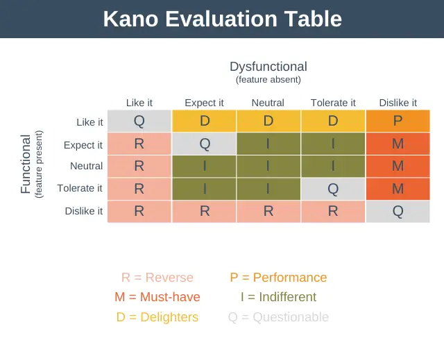

# Product Management

Best product management know-how

1. [Vision](#vision)
1. [Values](#values)
1. [Strategy](#strategy)
1. [Design & Research](#design--research)
1. [Analytical](#analytical)
1. [Product Development](#product-development)
1. [Product Marketing](#product-marketing)
1. [Product Sales](#product-sales)
1. [Team management](#team-management)
1. [Recruitment](#recruitment)

## Vision

- Prioritize as much as possible:

  > “People think focus means saying yes to the thing you've got to focus on. But that's not what it means at all. It means saying no to the hundred other good ideas that there are. You have to pick carefully. I'm actually as proud of the things we haven't done as the things I have done. Innovation is saying ‘no’ to 1,000 things.”
  >
  > \- Steve Jobs

- Aim for 10x, not 10%
- Take a long term view
- Make contact with the real world early
- Embrace failure as learning
- Fall in love with the problem, not the solution
- Be creative

  > If at first the idea is not absurd, then there is no hope for it.
  >
  > \- Albert Einstein

## Values

- **Challenge everything & inspire innovation through healthy discord**.

  The ability to speak freely, disagree with others’ opinions, and express one’s point of view each correlates strongly with how innovative the company is. The more people can speak up, the more groundbreaking the company’s progress.

  Foster questions such as "What ifs" and "Why does it have to be this way". Fight against conventional ways of thinking and behaving.

- **The system must protect the individuals**.

  A bug introduced in the latest commit? this is because of a missing test. The tests were not run before merging the feature branch? A continuous integration build should be set up to prevent merging any branch without passing tests. An architecture anti-pattern has been committed? a linting rule should be set up to detect and prevent such pattern. Botching developments last minutes? review how planning is made. Developers staying late and swamped with work? this might be due to poor priorization or resource management. etc

  Think [poka-yoke](https://en.wikipedia.org/wiki/Poka-yoke).

## Strategy

### Situation Analysis

- 5 C's
  - Company
  - Customers
  - Competitors
  - Collaborators
  - Climate: Political Economic Social/Cultural Technological Environmental Legal (PESTLE)
- SWOT Analysis
  - Strengths
  - Weaknesses
  - Opportunities
  - Threats
- Porter's Five Forces
  - Competitive Rivalry
  - Supplier Power
  - Buyer Power
  - Threat of Substitution
  - Threat of New Entry

### Competitive Analysis

- VRIN score
  - Value: What is the perceived value of the product?
  - Rarity: How innovative/different/unique is the product?
  - Inimitable: How difficult is it to replicate the product?
  - Non-substitutable: Can your customers not live without the product?
- [Economic moat](https://www.cbinsights.com/research/report/business-moats-competitive-advantage)
  - Network Effect moat: marketplace, data, platform
  - Cost moat: cost advantage, sunk cost, switching cost
  - Cultural moat: brand, tradition
  - Resource moat: intellectual property, knowledge, regulatory
- Unique Selling Proposition
  - What your brand does well
  - What consumers want
  - What your competitors do well
- [Behavior = Motivation + Prompts + Ability](https://behaviormodel.org/)

### Innovation Analysis

- Innovation Adoption Life-Cycle
  - Innovators 2.5%
  - Early adopters 13.5%
  - Early majority 34.0%
  - Late majority 34.0%
  - Laggards 16.0%
- Innovator's dilemma: established companies' resources, processes & values are incompatible with disruptive technologies (new market, new customers, less margins).
- Windermere Buying Hierarchy
  - Functionality: Range of Features, Intensity of Attribute, Appropriateness for Usage
  - Reliability: Longevity of performance, Trust in supplier, Availability of support
  - Convenience: Ease of Use, Accessibility of Product, Simplicity of Appropriation
  - Cost: Financial Costs, Physical Costs, Intangible Costs

### Change Management

- Kübler-Ross model: denial, anger, bargaining, depression, and acceptance.
- [Emotion wheel](https://humansystems.co/emotionwheels/)
- [ADKAR model](https://www.prosci.com/methodology/adkar):
  - Awareness of the need for change
  - Desire to participate and support the change
  - Knowledge on how to changer
  - Ability to implement the desired skills & behaviors
  - Reinforcement to sustain the change

## Design & Research

- create [personas](persona-template.md)
- perform [software UX interview](software-ux-interview-guide.md)
- a design session with written specifications must precede any written code
- include users in your design sessions
- KANO Model:

|                                                                          | I like it | I expect it | I am neutral | I can tolerate it | I dislike it |
| ------------------------------------------------------------------------ | --------- | ----------- | ------------ | ----------------- | ------------ |
| Functional: How would you feel if the product had [FEATURE]?             |           |             |              |                   |              |
| Dysfunctional: How would you feel if the product did not have [FEATURE]? |           |             |              |                   |              |

### Design Frameworks

- [CIRCLES](https://www.impactinterview.com/2016/06/circles-method-product-design-framework/)
  - Comprehend situation: what? Who? Why? How?
  - Identify customer: personas
  - Report customer needs: as XX, I want YY so that ZZ
  - Cut through priorisation
  - List solutions
  - Evaluate trade offs
  - Summarize recommendation
- [BUS](https://uxplanet.org/the-bus-product-design-framework-4e9fb6f81bcf)
- [UDR](https://blog.tryexponent.com/less-linear-approach-circles-product-design/)
- [Organizational Strategy Templates](http://www.drawtoast.com/templates.html)
- Ideation methods: [Re-expression, Revolution, Random links](https://www.interaction-design.org/literature/article/three-ideation-methods-to-enhance-your-innovative-thinking)

### Priorization Frameworks

- Value/Impact vs Complexity/Effort
  - High impact & Low effort: quick wins
  - High impact & High effort: major projects
  - Low impact & Low effort: fill-ins
  - Low impact & High effort: thankless tasks
- Weighted Scoring
- [RICE Scoring Model](https://www.productplan.com/glossary/rice-scoring-model/)
  - Reach
  - Impact
  - Confidence
  - Effort
- Eisenhower Matrix
  - Important & Urgent: Do
  - Important & Not Urgent: Schedule
  - Not Important & Urgent: Delegate
  - Not Important & Nor Urgent: Delete
- MoSCoW
  - Must-have
  - Should-have
  - Could-have
  - Will-not-have

## Analytical

- Define metrics to evaluate progress and improve the product.
- [HEART](https://www.interaction-design.org/literature/article/google-s-heart-framework-for-measuring-ux)
  - Happiness
  - Engagement
  - Adoption
  - Retention
  - Task success
- [GAME](https://hackernoon.com/metrics-game-framework-5e3dce1be8ac)
  - Goals
    - User goals
    - Business goals
  - Actions (AAARR)
    - Acquisition
    - Activation
    - Retention
    - Referral
    - Revenue
  - Metrics
    - Direct vs Proxy
    - Individual vs Aggregate
    - Magnitude vs Ratio
    - Intrinsic vs. Heuristic
  - Evaluations
    - Evaluating Metrics
    - Evaluating Actions
    - Evaluating Goals

## Product Development

- follow a Kanban-like agile methodology as much as possible, to lower the pressure on individuals and the temptation to botch developments. Do not be dogmatic about it.
- be iterative as much as possible: each development should be broken down into tiny pieces that should be quick to implement and review. Use feature flag to help merging features sooner.
- give rythm via scheduled, regular release where all committed developments are in.
- spread key required developments across releases and plan those in advance so that they are ready early in the release cycle.
- make a Release Candidate before the final release with a specific trial period that can't be reduced if tests coverage are not good.
- must have:
  - do code reviews.
  - never test the main branch: enforce all tests and linting are passing before merging on the main branch.
  - have end-to-end tests and good unit/integration tests coverage.
  - deprecate anti patterns with linters as soon as they are spotted.
- developments should (from the least to the most complex):
  - meet technical & functional requirements
  - prevent regression via unit, integration and e2e tests
  - design architecture and use patterns that ease support & extendability
  - enforce design in the long term. Ex: separate packages to ensure code isolation

## Product Marketing

- create [personas](persona-template.md) and anti-personas (segmentation)
- blog format templates
  - The "How-To" Post
  - The List-Based Post
  - The "What Is" Post
  - The Pillar Page Post
  - The Newsjacking Post
  - The Infographic Post
  - The Interview Post
- article introduction: grab the reader's attention in the first few paragraphs/sentences or they'll stop reading: tell a story or a joke, be empathetic, or grip the reader with an interesting fact or statistic. Then, describe the purpose of your post and explain how it will address a problem the reader may be experiencing.
- article conclusion: insert a CTA that indicates what you want the reader to do next: subscribe to your blog, download an ebook, register for a webinar or event, read a related article...
- [Storybrand framework](https://www.presentation-guru.com/the-most-successful-presentations-use-this-framework/):
  - A character
    - Who are you talking to? Customer/audience
    - What are their objectives?
  - ...has a problem
    - Villain: the thing or idea you and your customer/audience are fighting.
    - External: What the problem actually is
    - Internal: How does this problem make your audience feel?
    - Philosophical: Why is this problem bad?
  - ...and meets a guide
    - Empathy: Show that you understand the internal problem and frustrations of the character
    - Authority: Demonstrate why you should be the one to show them the way.
  - ...who gives them a plan
    - Process: Lay out 3-5 steps towards final goal.
    - Agreement: Show your audience that your path is safe and resolve fears.
  - ...and calls them to action
    - Direct CTA: CTAs are memorable, give the audience an instant win and therefore bolster the speaker’s authority.
    - Transitional CTA: Lead magnet. Think "Marry me or date me".
  - ...that ends in success
    - How will the world look in the future if the audience does everything you say? Great for motivating.
  - ...and avoids failure.
    - State what the stakes are and what might happen if nothing is done. Using this in an introduction can be a powerful motivator for the audience to listen to the rest of the speech.

## Product Sales

- create [personas](persona-template.md) and anti-personas (segmentation)
- be a source of information for each persona, show that we are good at what we do
- relationship mapping
  - categorize contacts
    - Influencers: Who has the most say on the future of your partnership?
    - Users: Who actually use your product or service and how do you help them succeed?
    - Leaders: Who are the Executives that have the power to raise concerns or put up roadblocks?
    - Decision makers: Who controls the resources?
    - Budget holders: Who has a financial stake?
  - assess side
    - Supporter: Who is on your side?
    - Detractor: Who doesn’t like you and actively tells people?
    - Champion: Who loves your company and sings your praises even when you’re not around? People that do the selling for you!

## Team Management

- meet with each individual of the team for 60 minutes every month or more with direct/honnest feedback from both sides.
  - Follow such a [template](./1-1-template.md)
  - Take notes of each interview.
  - Conduct "stay interview" on a regular basis to check in how they are feeling about the job with questions such as:
    - "What motivates you to stay here?"
    - "What might cause you to leave?"
    - "Do you feel that you are challenged?"
    - "What changes would you make to your job if you could?”
  - This is probably the single most powerful tool available to improve people and processes and prioritize what to focus on next.
- do regular [retrospective/post mortem sessions](./retrospective.md)
- favor [the ability to speak up freely over anonymous feedback](https://www.fastcompany.com/40518499/my-company-is-killing-anonymous-employee-feedback-heres-why): "Anonymity reinforces the idea that it’s risky to speak up.". Cf [Values](#values).
- organize post-mortem sessions on a regular basis to collectively share positive feedback and things to improve as well as ways to address those issues.
- foster safe environment where individuals help and trust each other: stealing work to achieve a deadline faster, help on merging a development...
- organize regular activities & outings with the team (bar, team lunch, climbing, bowling, laser tags...) sponsored or not to create a sense of camaraderie.
- job sculpt when possible: adapt task to each individual's strengths and desires.
- favor standard practices, patterns & tools as well as documentation for rapid & cheaper integration in a context of job hopping.
- provide transparency and share/document:
  - Roadmap: each team member's priority dev for next cycle.
  - Team's vacation and remote work.
  - HR common's questions: rules for working remotely, time off, traveling, expense, paperwork, visas...
  - Matrix skills detailing expected expertise and how to progress to the next level.

### Decision Making Frameworks

- DACI
  - Driver
  - Approver
  - Contributors
  - Informed

## Recruitment

- favor interview conditions that are as close as possible to real-life tasks: i.e. similar to what the candidates used or will use to develop. [Avoid whiteboards...](https://medium.com/javascript-scene/tech-hiring-has-always-been-broken-heres-how-i-survived-it-for-decades-b7ac33088de6)
- test candidates on how well they know what they pretend to know rather than how well they know what the interviewer knows. In other words, design the interview like a UX interview, with the end goal of testing how much candidates know their topics rather than asking questions to make the interviewer feel smart.
  - if the the interviewer knows well the topic, then they will be able to ask for more detailed information.
  - if the interviewer does not know the topic, then it will test the ability to explain and break down knowledge as clearly as possible for a novice audience.
- avoid questions expecting know-by-heart answers.
- favor technically good but balanced profiles over technically-strong candidates with weaker soft skills. This is vital to create a team of people that will get along well with each other. This means screening for ["soft skills" and "Emotional intelligence"](https://www.mindtheproduct.com/the-secret-sauce-to-hiring-great-product-people-by-kate-leto/) during interviews.
  - Look for "emotional intelligence": i.e. “the ability to recognise understand and manage our own emotions” and “the ability to recognise understand and influence the emotions of others”.
  - Include behavioral questions. Example: "Tell me about a time when you suggested something that someone disagreed with. What did you say? How did you handle the situation?"
- hide photos and names when selecting resumes to avoid any biases.
- job descriptions usually describe must-haves (usually hard skills) and nice-to-haves (usually soft skills). Instead, it should cover:
  - Purpose – why does this role exist?
  - Accountabilities – what outcomes is it responsible for?
  - Activities – what are the tasks and responsibilities?
  - Behaviours – the key capabilities of EQ
- [Ofman Quadrant](https://dyonhoekstra.weebly.com/daniel-ofmans-model-of-core-quadrants.html):
  - Quality
  - Pitfall
  - Allergy
  - Challenge
